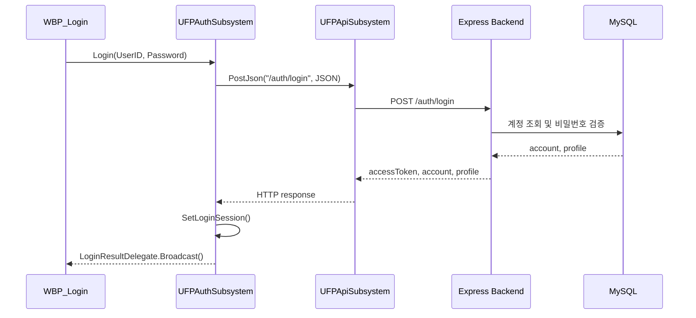

# UnrealEngine 로그인 기능

## 1. 구현 목표

`외부 PC에서 내 게임 서버에 접속해 회원가입과 로그인을 하고 정보를 DB에 저장해  
정보를 유지하는 것`

프로젝트를 하다 보면 사실상 마치 서버라는 개념이 거의 없던 콘솔 전용 게임을 만드는 것 같다.  
정말로 서버가 필요없는 싱글 콘솔 전용게임이더라 하더라도  
크랙판 문제로 인해 정상적인 게임인지 확인 하기 위해 요즘은 네트워크 연결 없이 할 수 있는 게임을 찾아 보기 힘들기에  

Backend를 깊게 들어가는 것이 아닌 작업을 할때 서버에서 동작하는 것을 확인 하기 위해  
Ai를 활용하여 Backend를 구축하고 활용하여 회원가입과 로그인을 제작하고자 한다.  

## 2. 전체 구조
[clever_cloud](https://www.clever.cloud/)에서 DB를 구축하고  
[render](https://render.com/)에서 Server를 구축했다  
</br>
현재 인증 흐름은 크게 두 영역으로 나뉘어서 작동한다.

- Unreal Client
  - `UFPAuthSubsystem`: 회원가입/로그인 요청과 응답 처리
  - `UFPApiSubsystem`: HTTP 요청 공통 처리
  - `UFPBackendSettings`: 백엔드 서버 주소 설정
  - `WBP_Login`: 블루프린트 위젯에서 로그인 UI 담당

- Node.js Backend
  - `authRoutes.js`: `/auth/register`, `/auth/login` 라우팅
  - `authController.js`: 요청 값 검증과 HTTP 응답 처리
  - `authService.js`: 인증 비즈니스 로직
  - `accountRepository.js`: MySQL 계정/프로필/인벤토리 데이터 접근
  - `authMiddleware.js`: JWT 인증이 필요한 API를 위한 토큰 검증 미들웨어
</br>

Unreal Client에서 HTTP 요청 과정을 추상화하여 간단하게 사용할 수 있도록 만들었다.

<summary>PostJson()</summary>

```cpp
    // 유효성 검사는 생략 
void UFPApiSubsystem::PostJson ( const FString& Path , const TSharedPtr<FJsonObject>& JsonObject , FFPApiResponseDelegate ResponseDelegate )
{
	FString RequestBody;

	TSharedRef<TJsonWriter<>> Writer = TJsonWriterFactory<>::Create ( &RequestBody );
	const bool bSerialized = FJsonSerializer::Serialize ( JsonObject.ToSharedRef ( ) , Writer );

	TSharedRef<IHttpRequest , ESPMode::ThreadSafe> Request = FHttpModule::Get ( ).CreateRequest ( );

	Request->SetURL ( MakeUrl ( Path ) );
	Request->SetVerb ( TEXT ( "POST" ) );
	Request->SetHeader ( TEXT ( "Content-Type" ) , TEXT ( "application/json" ) );
	Request->SetHeader ( TEXT ( "Accept" ) , TEXT ( "application/json" ) );
	Request->SetContentAsString ( RequestBody );

	Request->OnProcessRequestComplete ( ).BindLambda (
		[ ResponseDelegate ] ( FHttpRequestPtr RequestPtr , FHttpResponsePtr ResponsePtr , bool bWasSuccessful )
		{
			ResponseDelegate.ExecuteIfBound ( RequestPtr , ResponsePtr , bWasSuccessful );
		}
	);

	Request->ProcessRequest ( );
}
```
</details>

<summary>GetJson()</summary>

```cpp
void UFPApiSubsystem::GetJson ( const FString& Path, FFPApiResponseDelegate ResponseDelegate )
{

	TSharedRef<IHttpRequest , ESPMode::ThreadSafe> Request = FHttpModule::Get ( ).CreateRequest ( );

	Request->SetURL ( MakeUrl ( Path ) );
	Request->SetVerb ( TEXT ( "GET" ) );
	Request->SetHeader ( TEXT ( "Content-Type" ) , TEXT ( "application/json" ) );

	Request->OnProcessRequestComplete ( ).BindLambda (
		[ ResponseDelegate ] ( FHttpRequestPtr RequestPtr , FHttpResponsePtr ResponsePtr , bool bWasSuccessful )
		{
			ResponseDelegate.ExecuteIfBound ( RequestPtr , ResponsePtr , bWasSuccessful );
		}
	);

	Request->ProcessRequest ( );
}
```
</details>

`전체적인 흐름`


## 3. 백엔드 인증 API

Backend의 코드 부분은 AI를 활용하여 작성 한뒤  
디테일한 부분만 수정하는 방향으로 진행하여 큰 틀만 설명하자면.  
</br>
우선 로그인 관련 HTTP신호는 2가지로 회원가입과 로그인이 있다.  

| Method | Path | 역할 |
| --- | --- | --- |
| POST | `/auth/register` | 회원 가입 |
| POST | `/auth/login` | 로그인 |


### 회원가입 처리

회원가입은 `registerAccount()`에서 처리되며  

처리 순서를 코드와 함께 보자면

1. MySQL 커넥션을 가져오고 트랜잭션을 시작한다.
2. `UserID` 중복 여부를 확인한다.
3. `bcrypt.hash()`로 비밀번호를 해시한다.
4. `accounts` 테이블에 계정을 생성한다.
5. `player_profiles`에 기본 프로필을 생성한다.
6. `player_currencies`에 기본 재화를 생성한다.
7. 모든 작업이 성공하면 커밋하고 JWT를 발급한다.

단, 실패 시 `rollback()`의 호출로 계정의 불완전한 생성을 회피한다.

<summary>registerAccount()</summary>

```js
export async function registerAccount({ UserID, Password }) {
  const connection = await pool.getConnection(); // 풀에서 DB연결을 가져옴

  try {
    await connection.beginTransaction();

    const existingAccount = await findAccountByUserID(UserID, connection); // 중복 아이디 확인 

    if (existingAccount) {
      throw new Error("DUPLICATED_USER_ID"); // 중복 아이디 발견으로 인해 오류를 던짐
    }

    const passwordHash = await bcrypt.hash(Password, 10); // 입력된 비밀 번호를 해쉬 값으로 변경하여 저장

    const accountId = await createAccount(
      {
        UserID,// 아이디
        passwordHash, //해쉬값으로 변경된 비밀번호
        accountStatus: "ACTIVE" // 접속을 확인
      },
      connection
    );

    const profileData = await createPlayerProfile(accountId, connection); // 프로필 생성

    await createInventory(profileData , connection); // 인벤토리 생성

    await createDefaultCurrencies(profileData, connection);

    await connection.commit();

    const account = {
      account_id: accountId,
      UserID,
      account_status: "ACTIVE"
    };

    const profile = {
      profile_id: profileData,
      level: 1,
      exp: 0
    };

    const accessToken = createAccessToken(account); // 토큰 생성

    return {
      accessToken, 
      account,
      profile
    };
  } catch (err) {
    await connection.rollback();
    throw err;
  } finally {
    connection.release();
  }
}
```

</details> 


### 로그인 처리

로그인은 `loginAccount()`에서 처리되며.

마찬가지로 처리 순서를 코드와 함께 보자면

1. `UserID`로 계정을 조회한다.
2. `bcrypt.compare()`로 입력 비밀번호와 저장된 해시를 비교
3. 계정 상태가 `ACTIVE`인지 확인
4. `last_login_at`을 갱신
5. 계정에 연결된 프로필을 조회
6. JWT 액세스 토큰을 생성해 클라이언트에 반환

<summary>loginAccount()</summary>

```js
export async function loginAccount({ UserID, Password }) {
  const account = await findAccountByUserID(UserID);

  if (!account) {
    throw new Error("INVALID_LOGIN");
  }

  const isPasswordValid = await bcrypt.compare(
    Password,
    account.password_hash
  );

  if (!isPasswordValid) {
    throw new Error("INVALID_LOGIN");
  }

  if (account.account_status !== "ACTIVE") {
    throw new Error("ACCOUNT_BLOCKED");
  }

  await updateLastLoginAt(account.account_id);

  const profile = await findProfileByAccountId(account.account_id);

  const accessToken = createAccessToken(account);

  return {
    accessToken,
    account: {
      account_id: account.account_id,
      UserID: account.UserID,
      account_status: account.account_status
    },
    profile
  };
}
```
</details>

</br>

`반환 데이터`

```json
{
  "success": true,
  "accessToken": "jwt-token",
  "account": {
    "account_id": 1,
    "UserID": "test_user",
    "account_status": "ACTIVE"
  },
  "profile": {
    "profile_id": 1,
    "account_id": 1,
    "nickname": null,
    "level": 1,
    "exp": 0,
    "created_at": "..."
  }
}
```

## 4. JWT 발급과 보호 API

JWT는 `jsonwebtoken` 패키지로 생성한다.

```js
jwt.sign(
  {
    accountId: account.account_id,
    userId: account.UserID
  },
  process.env.JWT_SECRET,
  {
    expiresIn: process.env.JWT_EXPIRES_IN || "1h"
  }
);
```
토큰 payload에는 `accountId`와 `userId`가 담겨있어
인증이 필요한 API에서 토큰 검증을 과정을 통해 어떤 계정의 요청인지 알 수 있게 된다.

## 5. 언리얼 로그인 요청

언리얼에서 로그인 요청은 `UFPAuthSubsystem::Login()`이 담당한다.

클라이언트는 `UserID`, `Password`를 JSON으로 만들고 `/auth/login`으로 POST 요청을 보낸다.

```cpp
JsonObject->SetStringField(TEXT("UserID"), UserID);
JsonObject->SetStringField(TEXT("Password"), Password);

ApiSubsystem->PostJson(
    TEXT("/auth/login"),
    JsonObject,
    FFPApiResponseDelegate::CreateUObject(
        this,
        &UFPAuthSubsystem::OnLoginResponse
    )
);
```

응답은 `OnLoginResponse()`에서 처리한다.

처리 흐름은 다음과 같다.

1. HTTP 요청 성공 여부와 응답 객체 유효성을 확인한다.
2. 응답 바디를 문자열로 가져온다.
3. JSON 파싱을 수행한다.
4. `success` 값이 true인지 확인한다.
5. `accessToken`과 `account` 객체를 읽는다.
6. `SetLoginSession()`으로 클라이언트 세션 상태를 저장한다.
7. `LoginResultDelegate`를 브로드캐스트해 UI에 결과를 알린다.

로그인 성공 시 세션에 저장되는 값은 다음과 같다.

```cpp
Account = InAccountId;
User = InUserID;
AccessToken = InAccessToken;
```

현재 로그인 상태는 다음 조건으로 판단한다.

```cpp
return Account > 0 && !AccessToken.IsEmpty();
```

즉, 클라이언트 입장에서는 `AccountId`와 `AccessToken`이 모두 있어야 로그인된 상태로 본다.

## 6. UI와의 연결

`UFPAuthSubsystem`은 `BlueprintCallable` 함수와 `BlueprintAssignable` 델리게이트를 제공한다.

```cpp
UFUNCTION(BlueprintCallable, Category = "Auth")
void Login(const FString& UserID, const FString& Password);

UPROPERTY(BlueprintAssignable, Category = "Auth")
FFPAuthLoginResultDelegate LoginResultDelegate;
```


캡슐화로 인해 UI는 HTTP 세부 구현을 몰라도 된다.  
UI는 `Login()`을 호출하고, 성공/실패 결과만 받아 화면 전환이나 오류 메시지 표시를 처리하면 된다.

## 7. 로그인 이후 데이터 사용

로그인 세션은 이후 게임 데이터 요청에도 연결된다. 예를 들어 파티 편성 화면에서는 `UFPAuthSubsystem`에서 현재 로그인된 계정 ID를 가져와 보유 캐릭터 요청에 사용한다.

```cpp
PartyDataSubsystem->RequestOwnedCharacters(AuthSubsystem->GetAccountId());
```

## 8. 에러 처리

백엔드는 실패 상황마다 명확한 에러 코드를 반환한다.

| 상황 | HTTP Status | error |
| --- | --- | --- |
| UserID 또는 Password 누락 | 400 | `UserID_AND_PASSWORD_REQUIRED` |
| 중복 아이디 | 409 | `DUPLICATED_USER_ID` |
| 로그인 정보 불일치 | 401 | `INVALID_LOGIN` |
| 비활성 계정 | 403 | `ACCOUNT_BLOCKED` |
| 서버 오류 | 500 | `SERVER_ERROR` |

언리얼 클라이언트는 응답 JSON의 `success` 값을 기준으로 성공/실패를 나누고, 실패 시 `error` 필드를 UI로 전달한다.

## 9. 정리

- `UFPAuthSubsystem`은 인증 상태와 로그인/회원가입 요청을 담당한다.
- `UFPApiSubsystem`은 HTTP 요청 공통 기능을 담당한다.
- Express 백엔드는 route, controller, service, repository 계층으로 책임을 나눈다.
- 비밀번호는 평문 저장 대신 bcrypt 해시로 저장한다.
- 로그인 성공 시 JWT를 발급하고, 이후 보호 API는 `Authorization: Bearer <token>` 형식으로 인증한다.
- 회원가입은 트랜잭션으로 계정, 프로필, 인벤토리, 기본 재화를 함께 생성한다.


## 10. 작동 확인
로그인된 계정마다 다른 정보를 가지고 있음
<video controls src="../assets/img/posts/2026-05-16-LoginImplementation/login1.mp4" title="Title"></video>
</br>
<video controls src="../assets/img/posts/2026-05-16-LoginImplementation/login2.mp4" title="Title"></video>
## 11. 다음 개선 포인트

현재 구현을 기준으로 다음 단계에서 개선할 만한 부분도 보인다.

- 언리얼의 `GetJson()`에도 `Authorization` 헤더를 붙일 수 있는 공통 API 추가
- 로그인 응답의 `profile` 정보까지 클라이언트 세션에 저장
- 액세스 토큰 만료 시 재로그인 또는 refresh token 구조 도입
- 서버 로그와 클라이언트 로그에서 민감 정보가 출력되지 않도록 정리